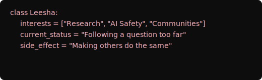

<table style="border:none;border-collapse:collapse;" width="100%">
  <tr>
    <td style="border:2px solid #d4607a;" valign="middle">
      
    </td>
    <td style="border:2px solid #d4607a;" align="right" valign="middle" width="45%">
      
      
      
    </td>
  </tr>
</table>

---

---

  

---

<h2>Stack</h2>

<b>Focus:</b> LLMs · AI Safety · Human Psychology · Prompt Engineering · NLP

---

<h2>GitHub Stats</h2>

---

<h2>Connect</h2>

---

<i>"I learn by building, breaking things, and documenting what actually happened, including the failures."</i>

